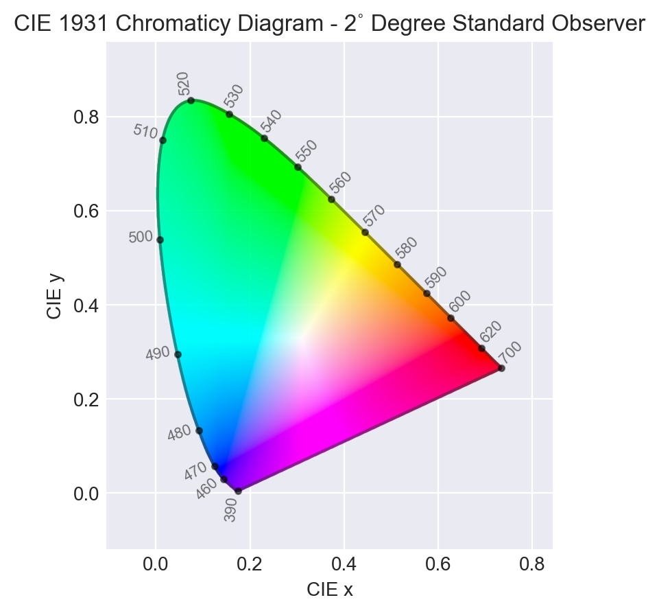
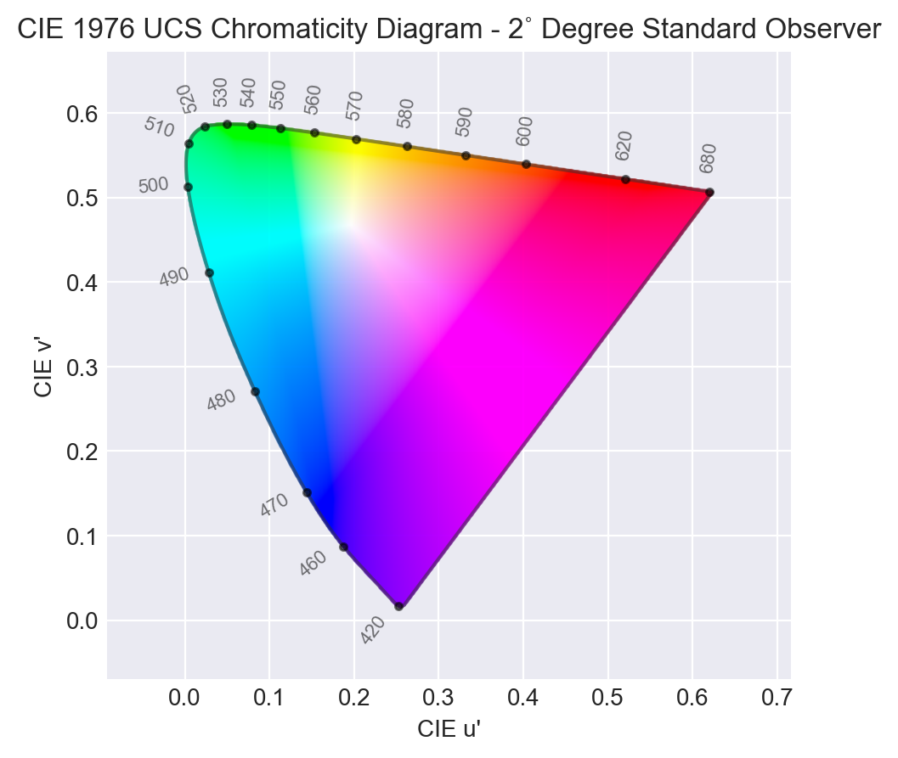
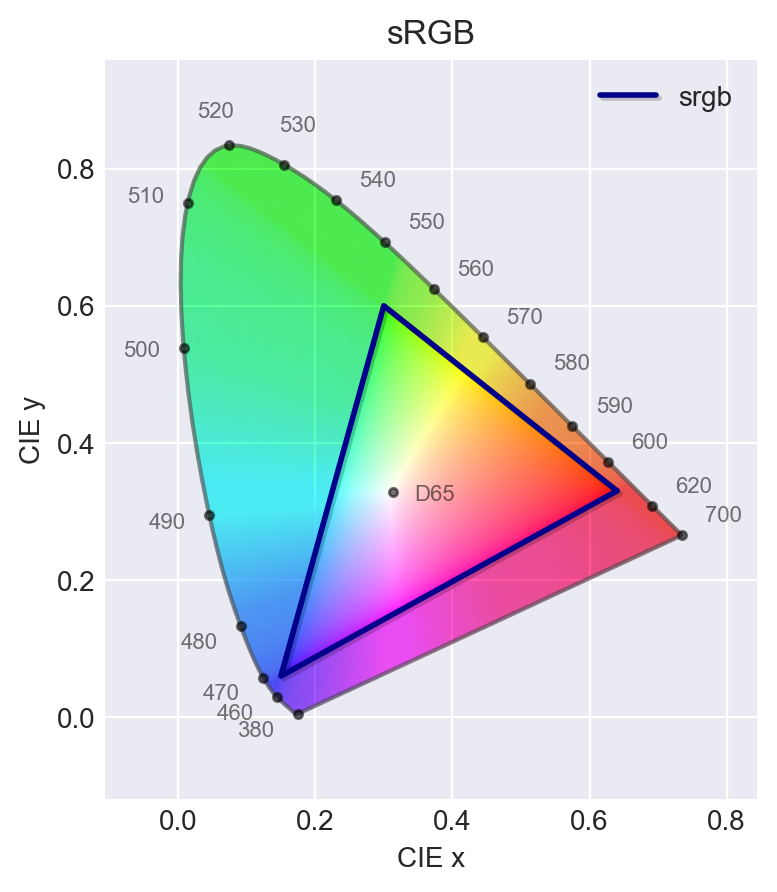

# Chromaticity Coordinates

In color science, the white point of an illuminant or of a display is a neutral reference characterized by a
chromaticity; all other chromaticities may be defined in relation to this reference. Often, when speaking about
chromaticity coordinates, we are talking about coordinates in one of the CIE chromaticity spaces like 1931 xy, 1960 uv,
or 1976 u'v'.

These coordinates are often use to represent all visible coordinates in what is called chromaticity diagrams. Over time,
their have been updates to how these points are represented, the 1931 xy being the first and the 1976 u'v' being the
latest. Even with newer and better models, you will still often see the 1931 xy diagram being used to display the
visible spectrum and gamuts of color spaces within it.

/// tab | 1931 xy Chromaticity Diagram

///

/// tab | 1960 uv Chromaticity Diagram

///

/// tab | 1931 u'v' Chromaticity Diagram

///

Color spaces are often defined by their chromaticity points. For instance, the sRGB color spaces defines their gamut
using chromaticity coordinates for the R, G, B channels. Additionally, it's D65 white point is defined by chromaticity
coordinates as well.



A color's chromaticity coordinates can be calculated directly from the XYZ tristimulus and are relative to that XYZ
space's white point.

## Getting Chromaticity Coordinates

To get the chromaticity points for a color, you simply need to convert that color to a chromaticity space. If we wanted
xy coordinates, converting to the xyY color space and retrieving the xy values is all that is needed.

While ColorAide does provide an [xyY color space](./colors/xyy.md), it is specifically relative to the D65 white point,
and so chromaticity coordinates acquired from it would only be accurate for spaces that use the D65 white point.

To make calculating the chromaticity coordinates for colors easy, ColorAide provides a few methods: `xy()`, `uv()`, and
`get_chromaticity()`. These methods will return the chromaticity coordinates relative to the current color space's white
point.

If all you care about is getting the 2D chromaticity coordinates, you can quickly acquire these by using `xy()` or
`uv()`. As there are a couple variations of uv, u'v' being the other, `uv()` takes a parameter to control what form the
uv coordinates are returned as: `1960` or `1976` (the default).

```py play
Color('red').uv('1976')
Color('red').uv('1960')
Color('red').xy()
```

In chromaticity diagrams the luminance is discarded, but if preserving the luminance is desired, the general purpose
`get_chromaticity()` method is a better choice. By specifying the mode, you can return the coordinates as xyY, uvY, and
u'v'Y, Y being the luminance. You can specify which form of chromaticity you want by specifying one of the accepted
modes: `xy-1931`, `uv-1960`, and `uv-1976` (the default).

```py play
Color('red').get_chromaticity()
Color('red').get_chromaticity('uv-1960')
Color('red').get_chromaticity('xy-1931')
```

If a set of white point chromaticities are provided, the values will be chromatically adapted to match the given white
point. `white` must be specified as xy chromaticity pair. If you have chromaticity values in a non-xy pair, see
[converting chromaticity coordinates](#converting-chromaticity-coordinates) for some more advanced manipulation.

```py play
from coloraide import cat
Color('red').get_chromaticity(white=cat.WHITES['2deg']['D50'])
```

/// tip
If you need to get the chromaticity coordinates for the white point of a given space, you can access them by directly
looking at the internal color space object, or by accessing any of the registered color spaces in the color space
mapping. The mapping, nor objects in the mapping, should never be modified directly.

```py play
Color('red')._space.WHITE
Color.CS_MAP['srgb'].WHITE
```
///

## Create Color From Chromaticity Coordinates

ColorAide also provides an easy way to go from chromaticity coordinates to a related color space of your choice.
`chromaticity()` is a generalized method that takes a color space to convert to and a set of chromaticity coordinates.
The chromaticity coordinates should be supplied using the same white point as the target color space.

```py play
uvY = Color('red').get_chromaticity()
Color.chromaticity('srgb', uvY)
```

If only given 2D chromaticity points, Y will be assumed as 1. In these cases, it is recommended to utilize RGB
normalization/scaling with a linear RGB gamut sufficient enough for the chromaticity coordinate range you are operating
in. Non-linear spaces will shift the chromaticity coordinates. The scaling color space can be set via `scale_space`.

```py play
uv = Color('red').uv()
Color.chromaticity('srgb', uv, scale=True)
uv = Color('display-p3', [1, 0, 0]).uv()
Color.chromaticity('display-p3', uv, scale=True, scale_space='display-p3-linear')
```

/// note
There is no RGB color space that perfectly encompasses the entire visible gamut. No matter what scaling space is
selected, extreme colors will require gamut mapping if the intent is to display them.
///

If the chromaticity points are provided with a different white point than the targeted color space, you can provide
the white chromaticity points (as xy pairs) for the chromaticity coordinates to force a proper translation.

```py play
from coloraide import cat
c1 = Color('prophoto-rgb', [1, 0, 0])
uvy = c1.get_chromaticity()
c2 = Color.chromaticity('srgb', uvy, white=cat.WHITES['2deg']['D50'])
c1, c2.convert('prophoto-rgb')
```

Keep in mind that `white` expects chromaticity points as xy pairs. If you have chromaticity values in a non-xy pair, see
[converting chromaticity coordinates](#converting-chromaticity-coordinates) for some more advanced manipulation.

## Converting Chromaticity Coordinates

ColorAide normally expects you are working with chromaticity points that are compatible with at least one of the
registered color spaces. In general, the API is set up with this expectation to make things easy for users. Normally,
the user will not need to manually specify a white point, but it is possible that a user may be working with or
exporting chromaticity coordinates to some space using an altogether different white point. Additionally, those white
points may be in some other form: uv or u'v'. To make transition easy between these formats, ColorAide provides a method
to make this easy.

```py play
from coloraide import util
Color('white').xy()
Color.convert_chromaticity('uv-1976', 'xy-1931', Color('white').uv())
Color.convert_chromaticity('uv-1960', 'xy-1931', Color('white').uv('1960'))
```

/// tip
In general, ColorAide expects the user is working with already registered spaces, all of which you can get the
chromaticity coordinates from. With that said, there may be advanced users who need to convert an external white point
to chromaticity coordinates, and that white point may be in XYZ coordinate system. While ColorAide doesn't directly
provide a method to convert an XYZ coordinate to chromaticity coordinates with the `Color` object, you can use an
internal utility function to do this.

```py play
from coloraide import util
color = Color('red')
xyz_w = color.white()
util.xyz_to_xyY(xyz_w)[:-1], color._space.WHITE
```
///
