# Supported Colors

ColorAide aims to support all the color spaces and models currently offered in modern CSS, such as sRGB, Display P3,
CIELAB, Oklab, etc. We also try to include a number of color spaces that are not available in CSS, but are generally
popular.

It is doubtful that we'll ever include all available color spaces that exist, but ColorAide is extensible and allows for
new color spaces and models to be added by anyone, even 3rd parties.

Currently, we also offer a separate package called [ColorAide Extras][extras] that provides some more color spaces:
Hunter Lab, xyY, IPT, etc. We will most likely keep less common and experimental spaces/models over there and be very
selective as to what we bring over here.

!!! warning "Possible Relocation of Some Color Spaces for 1.0.0"
    It is possible that before the 1.0.0 release that we may move some color spaces from ColorAide over to
    [ColorAide Extras][extras]. Any color spaces and associated ∆E methods not considered part of the CSS spec could
    could be considered for relocation. HSLuv, Jzazbz, DIN99o, CIELUV, and ICtCp are all examples of spaces that could
    be moved to ColorAide Extras in the future. This would provide a leaner package with the option for users to install
    the additional package and cherry pick the spaces of interest.

## RGB

RGB is a color model used by a number of different color spaces. The sRGB color space is probably the one most think of
when someone mentions RGB.

The RGB model represents colors with three channels: red, green, and blue. Though a number of color spaces use the RGB
model, how colors translate to those coordinates differs from one color space to another. Depending on the color space,
the range of colors within its gamut can be quite different.

### sRGB

<div class="info-container" markdown="1">
!!! info inline end "Properties"

    **Name:** `srgb`

    **White Point:** D65

    **Coordinates:**

    Name | Range^\*^
    ---- | -----
    r    | [0, 1]
    g    | [0, 1]
    b    | [0, 1]

    ^\*^ Range denotes _in gamut_ colors, but the color space supports an extended range beyond the gamut.

<figure markdown="1">


<figcaption>CIE 1931 xy Chromaticity -- sRGB Chromaticities</figcaption>
</figure>

The sRGB space is a standard RGB (red, green, blue) color space that HP and Microsoft created cooperatively in 1996 to
use on monitors, printers, and the Web. SRGB stands for "Standard RGB". It is the most widely used color space and is
supported by most operating systems, software programs, monitors, and printers.

_[Learn about sRGB](https://en.wikipedia.org/wiki/SRGB)_
</div>

??? abstract "ColorAide Details"

    **Channel Aliases:**
    : 
        Channels | Aliases
        -------- | -------
        `r`      | `red`
        `g`      | `green`
        `b`      | `blue`

    **Inputs:**
    : 
        Parsed input and string output formats support all valid CSS forms:

        ```css-color
        black                  // Color name
        #RRGGBBAA              // Hex
        rgb(r g b / a)         // RGB function
        rgb(r, g, b)           // Legacy RGB Function
        rgba(r, g, b, a)       // Legacy RGBA function
        color(srgb r g b / a)  // Color function
        ```

        When manually creating a color via raw data or specifying a color space as a parameter in a function, the color
        space name is always used:

        ```py
        Color("srgb", [0, 0, 0], 1)
        ```

    **Output:**
    : 
        The string representation of the color object will always default to the `#!css-color color(srgb r g b / a)`
        form, but the default string output will be the `#!css-color rgb(r g b / a)` form.

        ```playground
        Color("srgb", [0, 0, 0], 1)
        Color("srgb", [0, 0, 0], 1).to_string()
        ```

### sRGB Linear

<div class="info-container" markdown="1">
!!! info inline end "Properties"

    **Name:** `srgb-linear`

    **White Point:** D65

    **Coordinates:**

    Name | Range^\*^
    ---- | -----
    r    | [0, 1]
    g    | [0, 1]
    b    | [0, 1]

    ^\*^ Range denotes _in gamut_ colors, but the color space supports an extended range beyond the gamut.

<figure markdown="1">


<figcaption>CIE 1931 xy Chromaticity -- sRGB Linear Chromaticities</figcaption>
</figure>

The sRGB Linear space is the same as [sRGB](#srgb) *except* that the transfer function is linear-light (there is no gamma-encoding).

_[Learn about sRGB](https://en.wikipedia.org/wiki/SRGB)_
</div>

??? abstract "ColorAide Details"

    **Channel Aliases:**
    : 
        Channels | Aliases
        -------- | -------
        `r`      | `red`
        `g`      | `green`
        `b`      | `blue`

    **Inputs:**
    : 
        Parsed input and string output formats support all valid CSS forms:

        ```css-color
        color(srgb-linear r g b / a)  // Color function
        ```

        When manually creating a color via raw data or specifying a color space as a parameter in a function, the color
        space name is always used:

        ```py
        Color("srgb-linear", [0, 0, 0], 1)
        ```

    **Output:**
    : 
        The string representation of the color object and the default string output will be in the
        `#!css-color color(srgb-linear r g b / a)` form.

        ```playground
        Color("srgb-linear", [0, 0, 0], 1)
        Color("srgb-linear", [0, 0, 0], 1).to_string()
        ```

### Display P3

<div class="info-container" markdown="1">
!!! info inline end "Properties"

    **Name:** `display-p3`

    **White Point:** D65

    **Coordinates:**

    Name | Range^\*^
    ---- | -----
    r    | [0, 1]
    g    | [0, 1]
    b    | [0, 1]

    ^\*^ Range denotes _in gamut_ colors, but the color space supports an extended range beyond the gamut.

<figure markdown="1">


<figcaption>CIE 1931 xy Chromaticity -- Display P3 Chromaticities</figcaption>
</figure>

Display P3 is a combination of the DCI-P3 color gamut with the D65 white point together with the [sRGB](#srgb) gamma
curve. It originated from the DCI-P3 color gamut's implementation in digital cinema projectors, as this standard offers
more vibrant greens and reds than the traditional [sRGB](#srgb) color gamut.

_[Learn about Display P3](https://www.color.org/chardata/rgb/DisplayP3.xalter)_
</div>

??? abstract "ColorAide Details"

    **Channel Aliases:**
    : 
        Channels | Aliases
        -------- | -------
        `r`      | `red`
        `g`      | `green`
        `b`      | `blue`

    **Inputs**
    : 
        Parsed input and string output formats support all valid CSS forms:

        ```css-color
        color(display-p3 r g b / a)  // Color function
        ```

        When manually creating a color via raw data or specifying a color space as a parameter in a function, the color
        space name is always used:

        ```py
        Color("display-p3", [0, 0, 0], 1)
        ```

    **Output**
    : 
        The string representation of the color object and the default string output will be in the
        `#!css-color color(display-p3 r g b / a)` form.

        ```playground
        Color("display-p3", [0, 0, 0], 1)
        Color("display-p3", [0, 0, 0], 1).to_string()
        ```

### A98 RGB

<div class="info-container" markdown="1">

!!! info inline end "Properties"

    **Name:** `a98-rgb`

    **White Point:** D65

    **Coordinates:**

    Name | Range^\*^
    ---- | -----
    r    | [0, 1]
    g    | [0, 1]
    b    | [0, 1]

    ^\*^ Range denotes _in gamut_ colors, but the color space supports an extended range beyond the gamut.

<figure markdown="1">


<figcaption>CIE 1931 xy Chromaticity -- Adobe RGB 1998 Chromaticities</figcaption>
</figure>

The Adobe RGB (1998) color space or opRGB is a color space developed by Adobe Systems, Inc. in 1998. It was designed to
encompass most of the colors achievable on CMYK color printers, but by using [RGB](#srgb) primary colors on a device
such as a computer display. The Adobe RGB (1998) color space encompasses roughly 50% of the visible colors specified by
the [CIELAB](#cielab) color space - improving upon the gamut of the [sRGB](#srgb) color space, primarily in cyan-green
hues.

_[Learn about A98 RGB](https://en.wikipedia.org/wiki/Adobe_RGB_color_space)_
</div>

??? abstract "ColorAide Details"

    **Channel Aliases:**
    : 
        Channels | Aliases
        -------- | -------
        `r`      | `red`
        `g`      | `green`
        `b`      | `blue`

    **Inputs:**
    : 
        Parsed input and string output formats support all valid CSS forms:

        ```css-color
        color(a98-rgb r g b / a)  // Color function
        ```

        When manually creating a color via raw data or specifying a color space as a parameter in a function, the color
        space name is always used:

        ```py
        Color("a98-rgb", [0, 0, 0], 1)
        ```

    **Output**
    : 
        The string representation of the color object and the default string output will be in the
        `#!css-color color(a98-rgb r g b / a)` form.

        ```playground
        Color("a98-rgb", [0, 0, 0], 1)
        Color("a98-rgb", [0, 0, 0], 1).to_string()
        ```

### REC. 2020

<div class="info-container" markdown="1">
!!! info inline end "Properties"

    **Name:** `rec2020`

    **White Point:** D65

    **Coordinates:**

    Name | Range^\*^
    ---- | -----
    r    | [0, 1]
    g    | [0, 1]
    b    | [0, 1]

    ^\*^ Range denotes _in gamut_ colors, but the color space supports an extended range beyond the gamut.

<figure markdown="1">


<figcaption>CIE 1931 xy Chromaticity -- Rec. 2020 Chromaticities</figcaption>
</figure>

The Rec. 2020 color space is a very wide gamut RGB color space which is used in 4k and 8k UHDTV. ITU-R Recommendation
BT.2020, more commonly known by the abbreviations Rec. 2020 or BT.2020, defines various aspects of ultra-high-definition
television (UHDTV) with standard dynamic range (SDR) and wide color gamut (WCG), including picture resolutions, frame
rates with progressive scan, bit depths, color primaries, RGB and luma-chroma color representations, chroma
subsamplings, and an opto-electronic transfer function.

_[Learn about REC.2020](https://en.wikipedia.org/wiki/Rec._2020)_

</div>

??? abstract "ColorAide Details"

    **Channel Aliases:**
    : 
        Channels | Aliases
        -------- | -------
        `r`      | `red`
        `g`      | `green`
        `b`      | `blue`

    **Inputs:**
    : 

        Parsed input and string output formats support all valid CSS forms:

        ```css-color
        color(rec2020 r g b / a)  // Color function
        ```

        When manually creating a color via raw data or specifying a color space as a parameter in a function, the color
        space name is always used:

        ```py
        Color("rec2020", [0, 0, 0], 1)
        ```

    **Output:**
    : 
        The string representation of the color object and the default string output will be in the
        `#!css-color color(rec2020 r g b / a)` form.

        ```playground
        Color("rec2020", [0, 0, 0], 1)
        Color("rec2020", [0, 0, 0], 1).to_string()
        ```

### ProPhoto

<div class="info-container" markdown="1">
!!! info inline end "Properties"

    **Name:** `prophoto-rgb`

    **White Point:** D50

    **Coordinates:**

    Name | Range^\*^
    ---- | -----
    r    | [0, 1]
    g    | [0, 1]
    b    | [0, 1]

    ^\*^ Range denotes _in gamut_ colors, but the color space supports an extended range beyond the gamut.

<figure markdown="1">

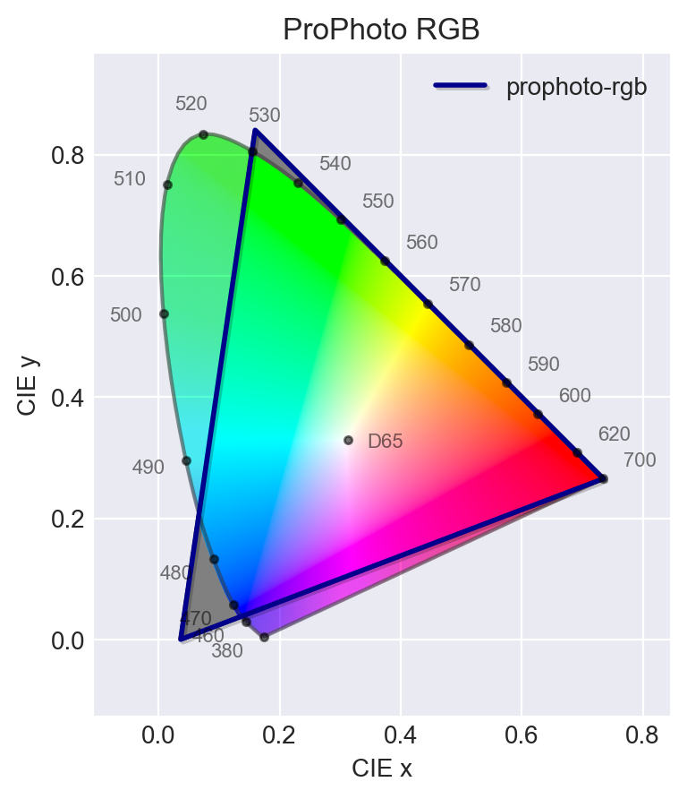

<figcaption>CIE 1931 xy Chromaticity -- ProPhoto RGB Chromaticities</figcaption>
</figure>

The ProPhoto RGB color space, also known as ROMM RGB (Reference Output Medium Metric), is an output referred RGB color
space developed by Kodak. It offers an especially large gamut designed for use with photographic output in mind. The
ProPhoto RGB color space encompasses over 90% of possible surface colors in the [CIE L\*a\*b\*](#cielab) color space,
and 100% of likely occurring real-world surface colors documented by Pointer in 1980.

??? abstract "ColorAide Details"

    **Channel Aliases:**
    : 
        Channels | Aliases
        -------- | -------
        `r`      | `red`
        `g`      | `green`
        `b`      | `blue`

    **Inputs:**
    : 
        Parsed input and string output formats support all valid CSS forms:

        ```css-color
        color(prophoto-rgb r g b / a)  // Color function
        ```

        When manually creating a color via raw data or specifying a color space as a parameter in a function, the color
        space name is always used:

        ```py
        Color("prophoto-rgb", [0, 0, 0], 1)
        ```
    **Output:**
    : 
        The string representation of the color object and the default string output will be in the
        `#!css-color color(prophoto-rgb r g b / a)` form.

        ```playground
        Color("prophoto-rgb", [0, 0, 0], 1)
        Color("prophoto-rgb", [0, 0, 0], 1).to_string()
        ```

_[Learn about ProPhoto](https://en.wikipedia.org/wiki/ProPhoto_RGB_color_space)_
</div>

## Cylindrical sRGB Spaces

The sRGB color space has been represented in a number of cylindrical models. Each model was an attempt to either align
the color with human perception or make it more intuitive to work with. The term "cylindrical" is used as the spaces
take on the shape of a cylinder, whereas the RGB model is very much a cube:

<figure markdown="1">


<figcaption>sRGB color space in 3D</figcaption>
</figure>

### HSV

<div class="info-container" markdown="1">
!!! info inline end "Properties"

    **Name:** `hsv`

    **White Point:** D65

    **Coordinates:**

    Name | Range
    ---- | -----
    h    | [0, 360)
    s    | [0, 1]
    v    | [0, 1]

<figure markdown="1">


<figcaption>HSV color space in 3D</figcaption>
</figure>

HSV is a color space similar to the modern [RGB](#srgb) and CMYK models. The HSV color space has three components: hue,
saturation and value. 'Value' is sometimes substituted with 'brightness' and then it is known as HSB. HSV models how
colors appear under light.

_[Learn about HSV](https://en.wikipedia.org/wiki/HSL_and_HSV)_
</div>

??? abstract "ColorAide Details"

    **Channel Aliases:**
    : 
        Channels | Aliases
        -------- | -------
        `h`      | `hue`
        `s`      | `saturation`
        `v`      | `value`

    **Inputs:**
    : 
        HSV is not supported via the CSS spec and the parser input and string output only supports the
        `#!css-color color()` function format using the custom name `#!css-color --hsv`:

        ```css-color
        color(--hsv 0 0% 0% / 1)
        ```

        When manually creating a color via raw data or specifying a color space as a parameter in a function, the color
        space name is always used:

        ```py
        Color("hsv", [0, 0, 0], 1)
        ```

    **Output:**
    : 
        The string representation of the color object and default string output will always use the
        `#!css-color color(hsv h s v / a)` form.

        ```playground
        Color("hsv", [0, 0, 0], 1)
        Color("hsv", [0, 0, 0], 1).to_string()
        ```

### HSL

<div class="info-container" markdown="1">
!!! info inline end "Properties"

    **Name:** `hsl`

    **White Point:**   D65

    **Coordinates:**

    Name | Range
    ---- | -----
    h    | [0, 360)
    s    | [0, 1]
    l    | [0, 1]

<figure markdown="1">


<figcaption>HSL color space in 3D</figcaption>
</figure>

HSL is an alternative representations of the [RGB](#srgb) color model, designed in the 1970s by computer graphics
researchers to more closely align with the way human vision perceives color-making attributes. In these models, colors
of each hue are arranged in a radial slice, around a central axis of neutral colors which ranges from black at the
bottom to white at the top.

HSL models the way different paints mix together to create color in the real world, with the lightness dimension
resembling the varying amounts of black or white paint in the mixture.

_[Learn about HSL](https://en.wikipedia.org/wiki/HSL_and_HSV)_
</div>

??? abstract "ColorAide Details"

    **Channel Aliases:**
    : 
        Channels | Aliases
        -------- | -------
        `h`      | `hue`
        `s`      | `saturation`
        `l`      | `lightness`

    **Inputs:**
    : 
        Parsed input and string output formats support all valid CSS forms. In addition, we also allow the `#!css-color 
        color()` function format using the custom name `#!css-color --hsl`:

        ```css-color
        hsl(h s l / a)          // HSL function
        hsl(h, s, l)            // Legacy HSL function
        hsla(h, s, l, a)        // Legacy HSLA function
        color(--hsl h s l / a)  // Color function
        ```

        When manually creating a color via raw data or specifying a color space as a parameter in a function, the color
        space name is always used:

        ```py
        Color("hsl", [0, 0, 0], 1)
        ```

    **Output:**
    : 
        The string representation of the color object will always default to the `#!css-color color(--hsl h s l / a)`
        form, but the default string output will be the `#!css-color hsl(h s l / a)` form.

        ```playground
        Color("hsl", [0, 0, 0], 1)
        Color("hsl", [0, 0, 0], 1).to_string()
        ```

### HWB

<div class="info-container" markdown="1">
!!! info inline end "Properties"

    **Name:** `hwb`

    **White Point:** D65

    **Coordinates:**

    Name | Range
    ---- | -----
    h    | [0, 360)
    w    | [0, 1]
    b    | [0, 1]

<figure markdown="1">

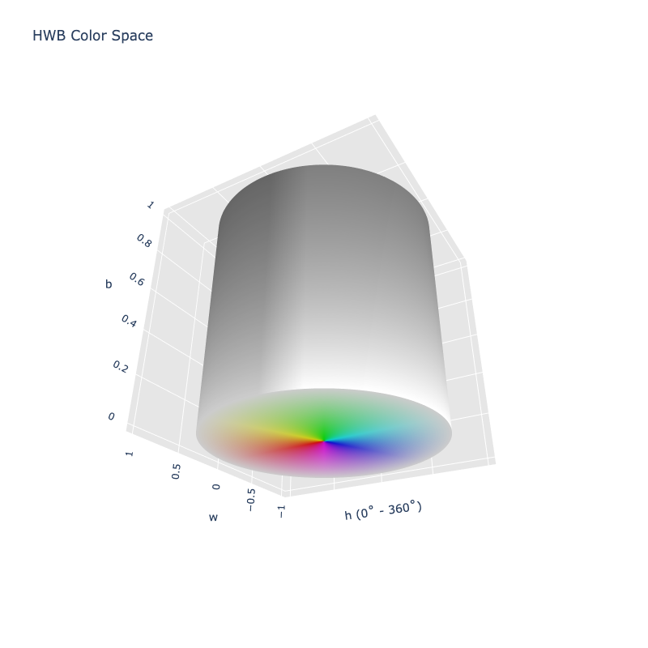

<figcaption>HWB color space in 3D</figcaption>
</figure>

HWB is a cylindrical-coordinate representation of points in an [RGB](#srgb) color model, similar to HSL and HSV. It was
developed by [HSV](#hsv)'s creator Alvy Ray Smith in 1996 to address some of the issues with HSV. HWB was designed to be
more intuitive for humans to use and slightly faster to compute. The first coordinate, H (Hue), is the same as the Hue
coordinate in [HSL](#hsl) and [HSV](#hsv). W and B stand for Whiteness and Blackness respectively and range from 0-100%
(or 0-1). The mental model is that the user can pick a main hue and then "mix" it with white and/or black to produce the
desired color.

_[Learn about HWB](https://en.wikipedia.org/wiki/HWB_color_model)_
</div>

??? abstract "ColorAide Details"

    **Channel Aliases:**
    : 
        Channels    | Aliases
        ----------- | -------
        `h`         | `hue`
        `w`         | `whiteness`
        `b`         | `blackness`

    **Inputs:**
    : 
        Parsed input and string output formats support all valid CSS forms. In addition, we also allow the
        `#!css-color color()` function format using the custom name `#!css-color --hwb`:

        ```css-color
        hwb(h w b / a)          // HWB function
        color(--hwb h w b / a)  // Color function
        ```

        When manually creating a color via raw data or specifying a color space as a parameter in a function, the color
        space name is always used:

        ```py
        Color("hwb", [0, 0, 100], 1)
        ```

    **Output:**
    : 
        The string representation of the color object will always default to the `#!css-color color(--hwb h w b / a)`
        form, but the default string output will be the `#!css-color hwb(h s l / a)` form.

        ```playground
        Color("hwb", [0, 0, 100], 1)
        Color("hwb", [0, 0, 100], 1).to_string()
        ```

### Okhsv

<div class="info-container" markdown="1">
!!! info inline end "Properties"

    **Name:** `okhsv`

    **White Point:** D65

    **Coordinates:**

    Name | Range
    ---- | -----
    h    | [0, 360)
    s    | [0, 1]
    v    | [0, 1]

<figure markdown="1">

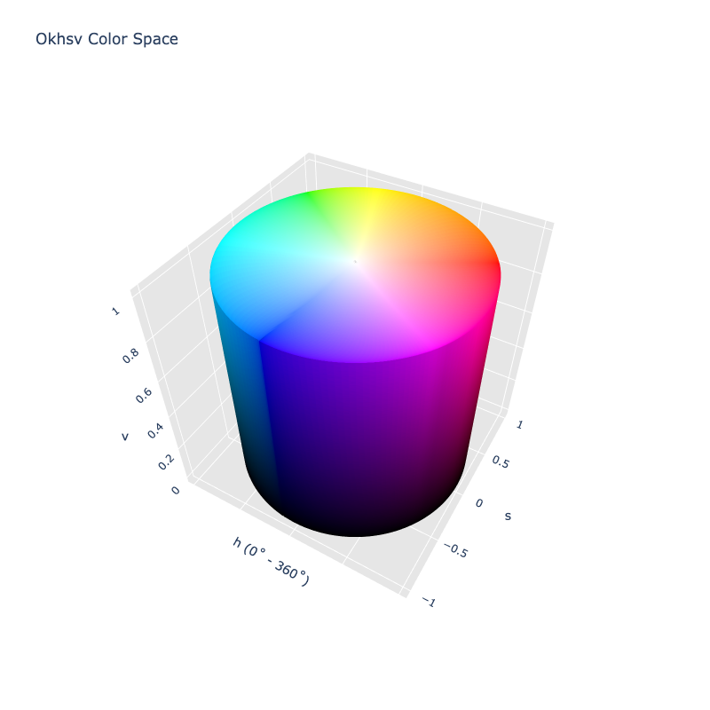

<figcaption>Okhsv color space in 3D</figcaption>
</figure>

Okhsv is a color space created by Björn Ottosson. It is based off his early work and leverages the [Oklab](#oklab) color
space. The aim was to create a color space that was better suited for being used in color pickers than the current HSV.

_[Learn about Okhsv](https://bottosson.github.io/posts/colorpicker/)_
</div>

??? abstract "ColorAide Details"

    **Channel Aliases:**
    : 
        Channels    | Aliases
        ----------- | -------
        `h`         | `hue`
        `s`         | `saturation`
        `v`         | `value`

    **Inputs:**
    : 
        Okhsv is not currently supported in the CSS spec, the parsed input and string output formats use the
        `#!css-color color()` function format using the custom name `#!css-color --okhsv`:

        ```css-color
        color(--okhsv h s l / a)  // Color function
        ```

        When manually creating a color via raw data or specifying a color space as a parameter in a function, the color
        space name is always used:

        ```py
        Color("okhsv", [0, 0, 0], 1)
        ```

    **Output:**
    : 
        The string representation of the color object and the default string output use the
        `#!css-color color(--okhsv h s l / a)` form.

        ```playground
        Color("okhsv", [0, 0, 0], 1)
        Color("okhsv", [0, 0, 0], 1).to_string()
        ```

### Okhsl

<div class="info-container" markdown="1">
!!! info inline end "Properties"

    **Name:** `okhsl`

    **White Point:** D65

    **Coordinates:**

    Name | Range
    ---- | -----
    h    | [0, 360)
    s    | [0, 1]
    l    | [0, 1]

<figure markdown="1">

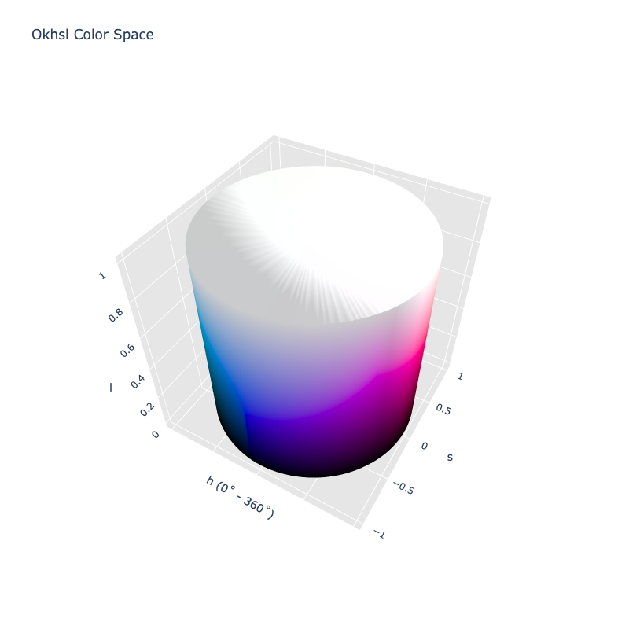

<figcaption>Okhsl color space in 3D</figcaption>
</figure>

Okhsl is a another color space created by Björn Ottosson. It is based off his early work and leverages the
[Oklab](#oklab) color space. The aim was to create a color space that was better suited for being used in color pickers
than the current HSL.

_[Learn about Okhsv](https://bottosson.github.io/posts/colorpicker/)_
</div>

??? abstract "ColorAide Details"

    **Channel Aliases:**
    : 
        Channels    | Aliases
        ----------- | -------
        `h`         | `hue`
        `s`         | `saturation`
        `l`         | `lightness`

    **Inputs:**
    : 
        Okhsl is not currently supported in the CSS spec, the parsed input and string output formats use the
        `#!css-color color()` function format using the custom name `#!css-color --okhsl`:

        ```css-color
        color(--okhsl h s l / a)  // Color function
        ```

        When manually creating a color via raw data or specifying a color space as a parameter in a function, the color
        space name is always used:

        ```py
        Color("okhsl", [0, 0, 0], 1)
        ```

    **Output:**
    : 
        The string representation of the color object and the default string output use the
        `#!css-color color(--okhsl h s l / a)` form.

        ```playground
        Color("okhsl", [0, 0, 0], 1)
        Color("okhsl", [0, 0, 0], 1).to_string()
        ```

### HSLuv

<div class="info-container" markdown="1">
!!! info inline end "Properties"

    **Name:** `hsluv`

    **White Point:** D65

    **Coordinates:**

    Name | Range
    ---- | -----
    h    | [0, 360)
    s    | [0, 100]
    l    | [0, 100]

<figure markdown="1">


<figcaption>HSLuv color space in 3D</figcaption>
</figure>

HSLuv is a human-friendly alternative to HSL. It was formerly known as "HUSL" and is a variation of the
[CIELCH~uv~](#cielchuv) color space, where the chroma component is replaced by a saturation component which allows you
to span all the available chroma as a percentage. HSLuv is constrained to the sRGB gamut.

_[Learn about HSLuv](https://www.hsluv.org/)_
</div>

??? abstract "ColorAide Details"

    **Channel Aliases:**
    : 
        Channels    | Aliases
        ----------- | -------
        `h`         | `hue`
        `s`         | `saturation`
        `l`         | `lightness`

    **Inputs:**
    : 
        HSLuv is not currently supported in the CSS spec, the parsed input and string output formats use the
        `#!css-color color()` function format using the custom name `#!css-color --hsluv`:

        ```css-color
        color(--hsluv h s l / a)  // Color function
        ```

        When manually creating a color via raw data or specifying a color space as a parameter in a function, the color
        space name is always used:

        ```py
        Color("hsluv", [0, 0, 0], 1)
        ```

    **Output:**
    : 
        The string representation of the color object and the default string output use the
        `#!css-color color(--hsluv h s l / a)` form.

        ```playground
        Color("hsluv", [0, 0, 0], 1)
        Color("hsluv", [0, 0, 0], 1).to_string()
        ```

## XYZ

The 1931 CIE XYZ color space encompasses all colors that are visible to a person with average eyesight. It also contains
many colors that the human eye cannot see:

<figure markdown="1">


<figcaption>CIE 1931 xy Chromaticity -- overlaid with the XYZ D65 space.</figcaption>
</figure>

In many color libraries, it is used as a space through which different color conversions are passed through as it is
large enough to contain all visible colors. Many conversions use matrices based on this space to do chromatic adaption
or just direct translations.

While the chromaticity diagrams we've shown all use [XYZ with a D65 white point](#xyz-d65) to help generate them, XYZ
can be represented with other white points as well. CSS actually allows using either [XYZ D50](#xyz-d50) or
[XYZ D65](#xyz-d65). We also provide both.

### XYZ D65

<div class="info-container" markdown="1">
!!! info inline end "Properties"

    **Name:** `xyz-d65`

    **White Point:** D65

    **Coordinates:**

    Name       | Range^\*^
    ---------- | ---------
    x          | [0.0, 1.0]
    y          | [0.0, 1.0]
    z          | [0.0, 1.0]

    ^\*^ Space is not bound to the range and is only used as a reference to quantify percentage inputs/outputs.

<figure markdown="1">

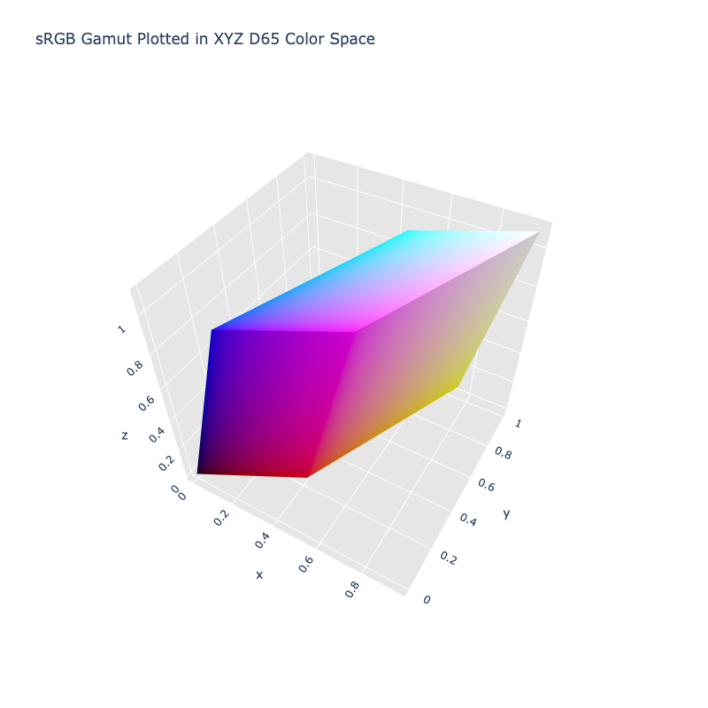

<figcaption markdown="1">Approximation[^1] of the sRGB gamut represented within the XYZ D65 color space.</figcaption>
</figure>

The CIE 1931 RGB color space and CIE 1931 XYZ color space were created by the International Commission on Illumination
(CIE) in 1931. They resulted from a series of experiments done in the late 1920s by William David Wright using ten
observers and John Guild using seven observers. The experimental results were combined into the specification of the
CIE RGB color space, from which the CIE XYZ color space was derived. The CIE 1931 color spaces are the first defined
quantitative links between distributions of wavelengths in the electromagnetic visible spectrum, and physiologically
perceived colors in human color vision.

_[Learn about XYZ](https://en.wikipedia.org/wiki/CIE_1931_color_space)_
</div>

??? abstract "ColorAide Details"

    **Channel Aliases:**
    : 
        Channels    | Aliases
        ----------- | -------
        `x`         |
        `y`         |
        `z`         |

    **Inputs:**
    : 
        Parsed input and string output formats use the `#!css-color color()` format with either `#!css-color xyz-d65`
        or `#!css-color xyz` as the identifier with the latter being an alias of the former.

        ```css-color
        color(xyz x y z / a)      // Color function
        color(xyz-d65 x y z / a)  // Color function alternate name
        ```

        When manually creating a color via raw data or specifying a color space as a parameter in a function, the color
        space name is always used:

        ```py
        Color("xyz-d65", [0, 0, 0], 1)
        ```

    **Output:**
    : 
        The string representation of the color object and the default string output will be in the 
        `#!css-color color(xyz-d65 x y z / a)` form.

        ```playground
        Color("xyz-d65", [0, 0, 0], 1)
        Color("xyz-d65", [0, 0, 0], 1).to_string()
        ```

### XYZ D50

<div class="info-container" markdown="1">
!!! info inline end "Properties"

    **Name:** `xyz-d50`

    **White Point:** D50

    **Coordinates:**

    Name       | Range^\*^
    ---------- | ---------
    x          | [0.0, 1.0]
    y          | [0.0, 1.0]
    z          | [0.0, 1.0]

    ^\*^ Space is not bound to the range and is only used as a reference to quantify percentage inputs/outputs.

<figure markdown="1">


<figcaption markdown="1">Approximation[^1] of the sRGB gamut represented within the XYZ D50 color space.</figcaption>
</figure>

XYZ D50 is the same as [XYZ D65](#xyz-d65) except it uses a D50 white point.

_[Learn about XYZ](https://en.wikipedia.org/wiki/CIE_1931_color_space)_
</div>

??? abstract "ColorAide Details"

    **Channel Aliases:**
    : 
        Channels    | Aliases
        ----------- | -------
        `x`         |
        `y`         |
        `z`         |

    **Inputs:**
    : 
        Parsed input and string output formats support all valid CSS forms:

        ```css-color
        color(xyz-d50 x y z / a)  // Color function
        ```

        When manually creating a color via raw data or specifying a color space as a parameter in a function, the color
        space name is always used:

        ```py
        Color("xyz-d50", [0, 0, 0], 1)
        ```

    **Output:**
    : 
        The string representation of the color object and the default string output will be in the
        `#!css-color color(xyz x y z / a)` form.

        ```playground
        Color("xyz-d50", [0, 0, 0], 1)
        Color("xyz-d50", [0, 0, 0], 1).to_string()
        ```

## CIELAB

CIELAB -- also referred to as L\*a\*b\* -- is another CIE color space. it was created as a perceptually uniform color
space. CIELAB doesn't really have a gamut, and pretty much any other color space can be mapped to it.

Much like [XYZ](#xyz), CIELAB and CIELCH currently use a [D50](#cielab-d50) white point just like the CSS, but we've
also included variants with D65 white points as well.

### CIELAB D50

<div class="info-container" markdown="1">
!!! info inline end "Properties"

    **Name:** `lab`

    **White Point:** D50

    **Coordinates:**

    Name | Range^\*^
    ---- | ---------
    l    | [0, 100]
    a    | [-125, 125]
    b    | [-125, 125]

    ^\*^ Space is not bound to the range and is only used as a reference to quantify percentage inputs/outputs in
    relation to the Display P3 color space.

<figure markdown="1">

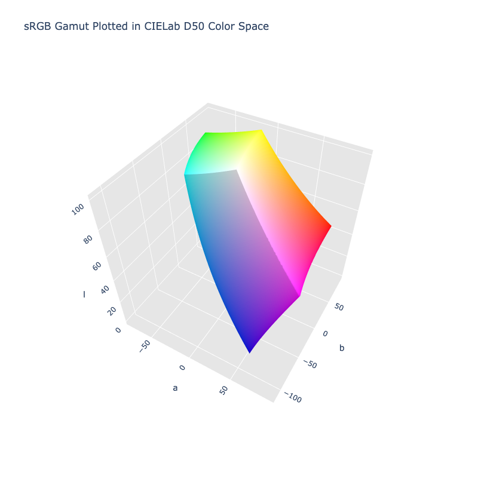

<figcaption markdown="1">Approximation[^1] of the sRGB gamut represented within the CIELAB D50 color space.</figcaption>
</figure>

The CIELAB color space also referred to as L\*a\*b\* is a color space defined by the International Commission on
Illumination (abbreviated CIE) in 1976. It expresses color as three values: L\* for perceptual lightness, and a\* and
b\* for the four unique colors of human vision: red, green, blue, and yellow. CIELAB was intended as a perceptually
uniform space, where a given numerical change corresponds to similar perceived change in color. While the CIELAB space
is not truly perceptually uniform, it nevertheless is useful in industry for detecting small differences in color.

_[Learn about CIELAB](https://en.wikipedia.org/wiki/CIELAB_color_space)_
</div>

??? abstract "ColorAide Details"

    **Channel Aliases:**
    : 
        Channels | Aliases
        -------- | -------
        `l`      | `lightness`
        `a`      |
        `b`      |

    **Inputs:**
    : 
        Parsed input and string output formats support all valid CSS forms. In addition, we also allow the
        `#!css-color color()` function format using the custom name `#!css-color --lab`:

        ```css-color
        lab(l a b / a)          // Lab function
        color(--lab l a b / a)  // Color function
        ```

        When manually creating a color via raw data or specifying a color space as a parameter in a function, the color
        space name is always used:

        ```py
        Color("lab", [0, 0, 0], 1)
        ```

    **Output:**
    : 
        The string representation of the color object will always default to the `#!css-color color(--lab l a b / a)`
        form, but the default string output will be the `#!css-color lab(l a b / a)` form.

        ```playground
        Color("lab", [0, 0, 0], 1)
        Color("lab", [0, 0, 0], 1).to_string()
        ```

### CIELAB D65

<div class="info-container" markdown="1">
!!! info inline end "Properties"

    **Name:** `lab-d65`

    **White Point:** D65

    **Coordinates:**

    Name | Range^\*^
    ---- | ---------
    l    | [0, 100]
    a    | [-130, 130]
    b    | [-130, 130]

    ^\*^ Space is not bound to the range and is only used as a reference to quantify percentage inputs/outputs in
    relation to the Display P3 color space.

<figure markdown="1">

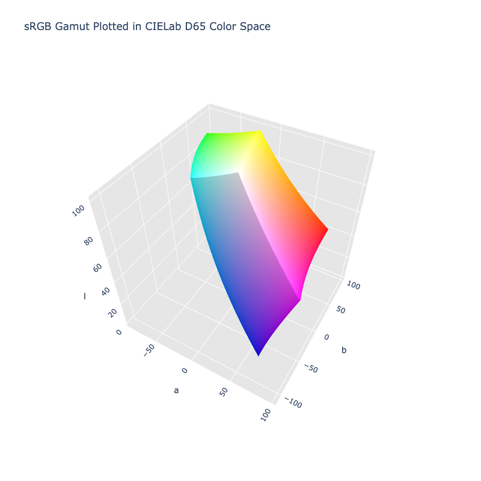

<figcaption markdown="1">Approximation[^1] of the sRGB gamut represented within the CIELAB D50 color space.</figcaption>
</figure>

CIELAB D65 is the same as [CIELAB](#cielab-d50) except it uses a D65 white point.

_[Learn about CIELAB](https://en.wikipedia.org/wiki/CIELAB_color_space)_
</div>

??? abstract "ColorAide Details"

    **Channel Aliases:**
    : 
        Channels | Aliases
        -------- | -------
        `l`      | `lightness`
        `a`      |
        `b`      |

    **Inputs:**
    : 
        As a D65 variant of CIELAB is not currently supported in the CSS spec, the parsed input and string output
        formats use the `#!css-color color()` function format using the custom name `#!css-color --lab-d65`:

        ```css-color
        color(--lab-d65 l a b / a)  // Color function
        ```

        When manually creating a color via raw data or specifying a color space as a parameter in a function, the color
        space name is always used:

        ```py
        Color("lab-d65", [0, 0, 0], 1)
        ```

    **Output:**
    : 
        The string representation of the color object and the default string output use the
        `#!css-color color(--lab-d65 l a b / a)` form.

        ```playground
        Color("lab-d65", [0, 0, 0], 1)
        Color("lab-d65", [0, 0, 0], 1).to_string()
        ```

## CIELCH

CIELAB generally is not an intuitive space to work with and instead is often converted to cylindrical coordinates with
hues represented as degrees and a chroma and lightness channel. The shape of the color space doesn't really change,
just how the colors are manipulated. CIELCH, like CIELAB, is available with a D50 white point that matches CSS and a
D65 white point.

### CIELCH D50

<div class="info-container" markdown="1">
!!! info inline end "Properties"

    **Name:** `lch`

    **White Point:** D50

    **Coordinates:**

    Name | Range^\*^
    ---- | ---------
    l    | [0, 100]
    c    | [0, 150]
    h    | [0, 360)

    ^\*^ Space is not bound to the range and is only used as a reference to quantify percentage inputs/outputs in
    relation to the Display P3 color space.

<figure markdown="1">

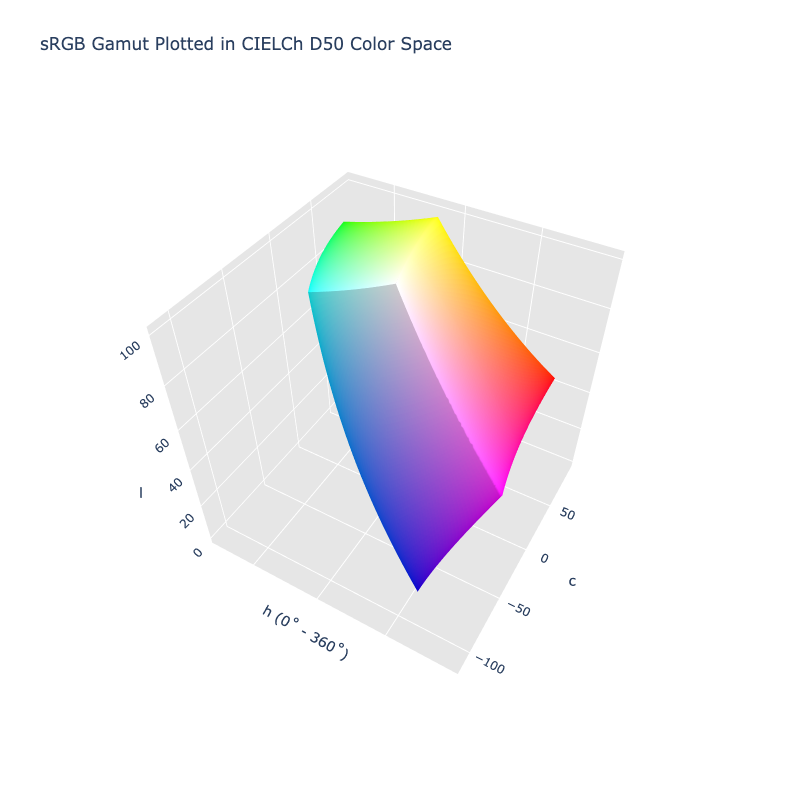

<figcaption markdown="1">Approximation[^1] of the sRGB gamut represented within the CIELCH D50 color space.</figcaption>
</figure>

The "CIELCH" or "CIEHLC" space is a color space based on [CIELAB](#cielab), which uses the polar coordinates C\*
(chroma, relative saturation) and h&deg; (hue angle, angle of the hue in the CIELAB color wheel) instead of the Cartesian
coordinates a\* and b\*. The CIELAB lightness L\* remains unchanged.

_[Learn about CIELCH](https://en.wikipedia.org/wiki/CIELAB_color_space#Cylindrical_representation:_CIELCh_or_CIEHLC)_
</div>

??? abstract "ColorAide Details"

    **Channel Aliases:**
    : 
        Channels | Aliases
        -------- | -------
        `l`      | `lightness`
        `c`      | `chroma`
        `h`      | `hue`

    **Inputs:**
    : 
        Parsed input and string output formats support all valid CSS forms. In addition, we also allow the
        `#!css-color color()` function format using the custom name `#!css-color --lch`:

        ```css-color
        lch(l c h / a)          // Lch function
        color(--lch l c h / a)  // Color function
        ```

        When manually creating a color via raw data or specifying a color space as a parameter in a function, the color
        space name is always used:

        ```py
        Color("lch", [0, 0, 0], 1)
        ```

    **Output:**
    : 
        The string representation of the color object will always default to the `#!css-color color(--lch l c h / a)`
        form, but the default string output will be the `#!css-color lch(l c h / a)` form.

        ```playground
        Color("lch", [0, 0, 0], 1)
        Color("lch", [0, 0, 0], 1).to_string()
        ```

### CIELCH D65

<div class="info-container" markdown="1">
!!! info inline end "Properties"

    **Name:** `lch-d65`

    **White Point:** D65

    **Coordinates:**

    Name | Range^\*^
    ---- | ---------
    l    | [0, 100]
    c    | [0, 160]
    h    | [0, 360)

    ^\*^ Space is not bound to the range and is only used as a reference to quantify percentage inputs/outputs in
    relation to the Display P3 color space.

<figure markdown="1">


<figcaption markdown="1">Approximation[^1] of the sRGB gamut represented within the CIELCH D65 color space.</figcaption>
</figure>

CIELCH D65 is the same as [CIELCH](#cielch-d50) except it uses a D65 white point.

_[Learn about CIELCH](https://en.wikipedia.org/wiki/CIELAB_color_space#Cylindrical_representation:_CIELCh_or_CIEHLC)_
</div>

??? abstract "ColorAide Details"

    **Channel Aliases:**
    : 
        Channels | Aliases
        -------- | -------
        `l`      | `lightness`
        `c`      | `chroma`
        `h`      | `hue`

    **Inputs:**
    : 
        As a D65 variant of CIELCH is not currently supported in the CSS spec, the parsed input and string output
        formats use the `#!css-color color()` function format using the custom name `#!css-color --lch-d65`:

        ```css-color
        color(--lch-d65 l c h / a)  // Color function
        ```

        When manually creating a color via raw data or specifying a color space as a parameter in a function, the color
        space name is always used:

        ```py
        Color("lch-d65", [0, 0, 0], 1)
        ```

    **Outputs:**
    : 
        The string representation of the color object and the default string output use the
        `#!css-color color(--lch-d65 l c h / a)` form.

        ```playground
        Color("lch-d65", [0, 0, 0], 1)
        Color("lch-d65", [0, 0, 0], 1).to_string()
        ```

## Oklab

<div class="info-container" markdown="1">
!!! info inline end "Properties"

    **Name:** `oklab`

    **White Point:** D65

    **Coordinates:**

    Name | Range^\*^
    ---- | ---------
    l    | [0, 1]
    a    | [-0.4, 0.4]
    b    | [-0.4, 0.4]

    ^\*^ Space is not bound to the range and is only used as a reference to quantify percentage inputs/outputs in
    relation to the Display P3 color space.

<figure markdown="1">

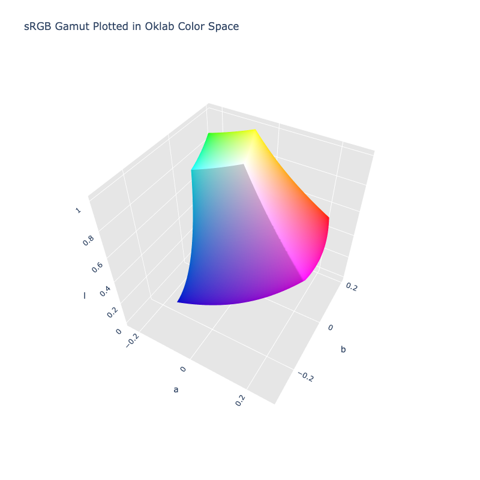

<figcaption markdown="1">Approximation[^1] of the sRGB gamut represented within the Oklab color space.</figcaption>
</figure>


A new perceptual color space that claims to be simple to use, while doing a good job at predicting perceived lightness,
chroma and hue. It is called the Oklab color space, because it is an OK Lab color space.

_[Learn about Oklab](https://bottosson.github.io/posts/oklab/)_
</div>

??? abstract "ColorAide Details"

    **Channel Aliases:**
    : 
        Channels | Aliases
        -------- | -------
        `l`      | `lightness`
        `a`      |
        `b`      |

    **Inputs:**
    : 
        Oklab is not currently supported in the CSS spec, the parsed input and string output formats use the
        `#!css-color color()` function format using the custom name `#!css-color --oklab`:

        ```css-color
        oklab(l a b / a)          // Oklab function
        color(--oklab l a b / a)  // Color function
        ```

        When manually creating a color via raw data or specifying a color space as a parameter in a function, the color
        space name is always used:

        ```py
        Color("oklab", [0, 0, 0], 1)
        ```

    **Output:**
    : 
        The string representation of the color object will always default to the `#!css-color color(--oklab l a b / a)`
        form, but the default string output will be the `#!css-color oklab(l a b / a)` form.

        ```playground
        Color("oklab", [0, 0, 0], 1)
        Color("oklab", [0, 0, 0], 1).to_string()
        ```

## Oklch

<div class="info-container" markdown="1">
!!! info inline end "Properties"

    **Name:** `oklch`

    **White Point:** D65

    **Coordinates:**

    Name | Range^\*^
    ---- | ---------
    l    | [0, 1]
    c    | [0, 0.4]
    h    | [0, 360)

    ^\*^ Space is not bound to the range and is only used as a reference to quantify percentage inputs/outputs in
    relation to the Display P3 color space.

<figure markdown="1">

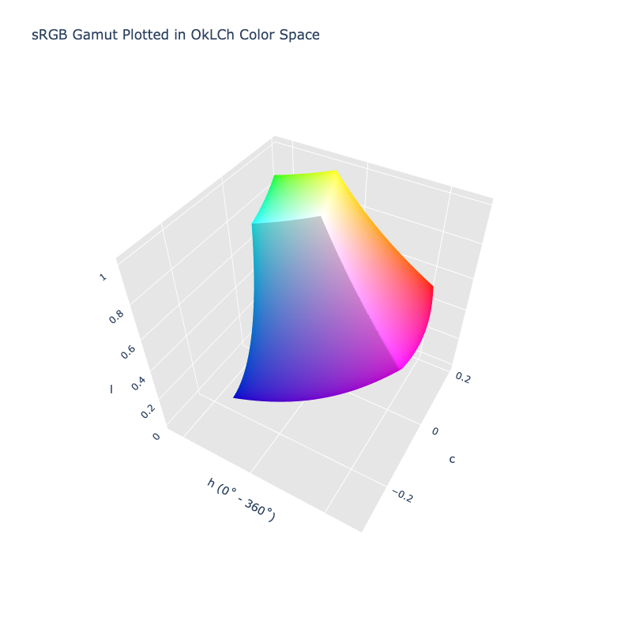

<figcaption markdown="1">Approximation[^1] of the sRGB gamut represented within the Oklch color space.</figcaption>
</figure>


Oklch is the cylindrical form of [Oklab](#oklab).

_[Learn about Oklch](https://bottosson.github.io/posts/oklab/)_
</div>

??? abstract "ColorAide Details"

    **Channel Aliases:**
    : 
        Channels | Aliases
        -------- | -------
        `l`      | `lightness`
        `c`      | `chroma`
        `h`      | `hue`

    **Inputs**
    : 

        Oklab is not currently supported in the CSS spec, the parsed input and string output formats use the
        `#!css-color color()` function format using the custom name `#!css-color --oklch`:

        ```css-color
        oklch(l c h / a)          // Oklch function
        color(--oklch l c h / a)  // Color function
        ```

    **Output:**
    : 
        The string representation of the color object will always default to the `#!css-color color(--oklch l c h / a)`
        form, but the default string output will be the `#!css-color oklch(l a b / a)` form.

        ```playground
        Color("oklch", [0, 0, 0], 1)
        Color("oklch", [0, 0, 0], 1).to_string()
        ```

## CIELUV

<div class="info-container" markdown="1">
!!! info inline end "Properties"

    **Name:** `luv`

    **White Point:** D65

    **Coordinates:**

    Name | Range^\*^
    ---- | ---------
    l    | [0, 100]
    u    | [-215, 215]
    v    | [-215, 215]

    ^\*^ Space is not bound to the range and is only used as a reference to quantify percentage inputs/outputs in
    relation to the Display P3 color space.

<figure markdown="1">

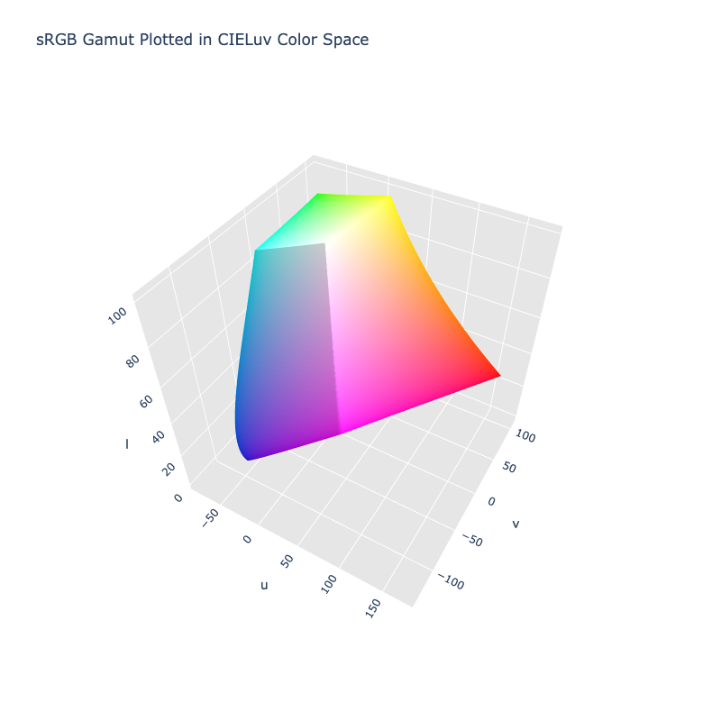

<figcaption markdown="1">Approximation[^1] of the sRGB gamut represented within the CIELUV D65 color space.</figcaption>
</figure>

CIELUV is similar to CIELAB as they were both developed in 1976 as perceptually uniform color spaces, both are derived
from the color experiments in 1931 that brought us the XYZ color space, and neither are truly perceptually uniform.

The difference between the two comes from their intent. CIELAB attempted to create a space that aligned well with
human vision. CIELUV, on the other hand, was designed to be an easier-to-compute transformation of the 1931 CIE XYZ
color space.

CIELAB is more commonly used in subtractive color applications (printed pages, dyes, etc.), while CIELUV is better
suited in additive color applications such as display colorimetry (monitors, TVs, etc.).

_[Learn about CIELUV](https://en.wikipedia.org/wiki/CIELUV)_
</div>

??? abstract "ColorAide Details"

    **Channel Aliases:**
    : 
        Channels | Aliases
        -------- | -------
        `l`      | `lightness`
        `u`      |
        `v`      |

    **Inputs:**
    : 
        As CIELUV D65 is not currently supported in the CSS spec, the parsed input and string output formats use the
        `#!css-color color()` function format using the custom name `#!css-color --luv`:

        ```css-color
        color(--luv l u v / a)  // Color function
        ```

        When manually creating a color via raw data or specifying a color space as a parameter in a function, the color
        space name is always used:

        ```py
        Color("luv", [0, 0, 0], 1)
        ```

    **Outputs**
    : 
        The string representation of the color object and the default string output use the
        `#!css-color color(--luv l u v / a)` form.

        ```playground
        Color("luv", [0, 0, 0], 1)
        Color("luv", [0, 0, 0], 1).to_string()
        ```

## CIELCH~uv~

<div class="info-container" markdown="1">
!!! info inline end "Properties"

    **Name:** `lchuv`

    **White Point:** D65

    **Coordinates:**

    Name | Range^\*^
    ---- | ---------
    l    | [0, 100]
    c    | [0, 220]
    h    | [0, 360)

    ^\*^ Space is not bound to the range and is only used as a reference to quantify percentage inputs/outputs in
    relation to the Display P3 color space.

<figure markdown="1">

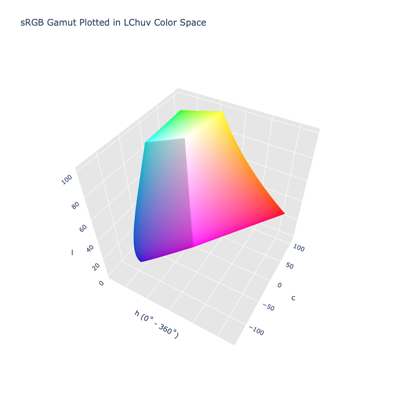

<figcaption markdown="1">Approximation[^1] of the sRGB gamut represented within the CIELCH~uv~ color space.</figcaption>
</figure>

[CIELUV](#cieluv) is not an intuitive space to work with directly and instead is often converted to cylindrical
coordinates with hues represented as degrees and a chroma and lightness channel. The shape of the color space doesn't
really change, just how the colors are manipulated.

_[Learn about CIELCH~uv~](https://en.wikipedia.org/wiki/CIELUV)_
</div>

??? abstract "ColorAide Details"

    **Channel Aliases:**
    : 
        Channels | Aliases
        -------- | -------
        `l`      | `lightness`
        `c`      | `chroma`
        `h`      | `hue`

    **Inputs:**
    : 
        As CIELCH~uv~ is not currently supported in the CSS spec, the parsed input and string output formats use the
        `#!css-color color()` function format using the custom name `#!css-color --lchuv`:

        ```css-color
        color(--lchuv l c h / a)  // Color function
        ```

        When manually creating a color via raw data or specifying a color space as a parameter in a function, the color
        space name is always used:

        ```py
        Color("lchuv", [0, 0, 0], 1)
        ```

    **Output:**
    : 
        The string representation of the color object and the default string output use the
        `#!css-color color(--lchuv l c h / a)` form.

        ```playground
        Color("lchuv", [0, 0, 0], 1)
        Color("lchuv", [0, 0, 0], 1).to_string()
        ```

## Jzazbz

<div class="info-container" markdown="1">
!!! info inline end "Properties"

    **Name:** `jzazbz`

    **White Point:** D65

    **Coordinates:**

    Name | Range^\*^
    ---- | ---------
    jz   | [0, 1]
    az   | [-0.5, 0.5]
    bz   | [-0.5, 0.5]

    ^\*^ Space is not physically bound to the range, but represents the originally design limits per the spec and is
    used to quantify percentage inputs/outputs.

<figure markdown="1">

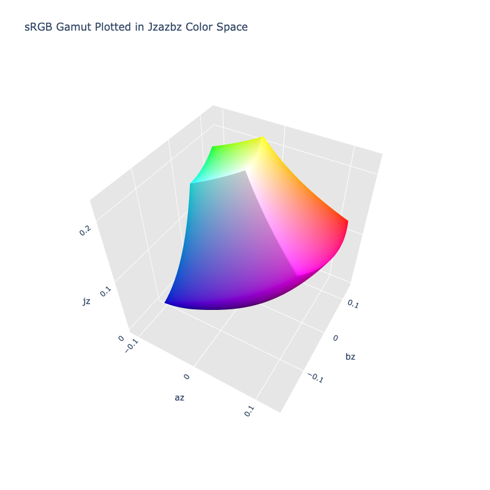

<figcaption markdown="1">Approximation[^1] of the sRGB gamut represented within the Jzazbz color space.</figcaption>
</figure>

Jzazbz is a a color space designed for perceptual uniformity in high dynamic range (HDR) and wide color gamut (WCG)
applications. Conceptually it is similar to [CIELAB](#cielab), but claims the following improvements:

- Perceptual color difference is predicted by Euclidean distance.
- Perceptually uniform: MacAdam ellipses of just-noticeable-difference (JND) are more circular, and closer to the same
  sizes.
- Hue linearity: changing saturation or lightness has less shift in hue.

_[Learn about Jzazbz](https://www.osapublishing.org/oe/fulltext.cfm?uri=oe-25-13-15131&id=368272)_
</div>

??? abstract "ColorAide Details"

    **Channel Aliases:**
    : 
        Channels | Aliases
        -------- | -------
        `jz`     | `lightness`
        `az`     | `a`
        `bz`     | `b`

    **Inputs**
    : 
        As Jzazbz is not currently supported in the CSS spec, the parsed input and string output formats use the
        `#!css-color color()` function format using the custom name `#!css-color --jzazbz`:

        ```css-color
        color(--jzazbz jz az bz / a)  // Color function
        ```

        When manually creating a color via raw data or specifying a color space as a parameter in a function, the color
        space name is always used:

        ```py
        Color("jzazbz", [0, 0, 0], 1)
        ```

    **Output**
    : 
        The string representation of the color object and the default string output use the
        `#!css-color color(--jzazbz jz az bz / a)` form.

        ```playground
        Color("jzazbz", [0, 0, 0], 1)
        Color("jzazbz", [0, 0, 0], 1).to_string()
        ```

## JzCzhz

<div class="info-container" markdown="1">
!!! info inline end "Properties"

    **Name:** `jzczhz`

    **White Point:** D65

    **Coordinates:**

    Name | Range
    ---- | -----
    jz   | [0, 1]
    cz   | [0, 1]
    hz   | [0, 360)

    ^\*^ Space is not physically bound to the range, but represents the originally design limits per the spec and is
    used to quantify percentage inputs/outputs.

<figure markdown="1">


<figcaption markdown="1">Approximation[^1] of the sRGB gamut represented within the JzCzhz color space.</figcaption>
</figure>

JzCzhz is the cylindrical form of [Jzazbz](#jzazbz).

_[Learn about JzCzhz](https://www.osapublishing.org/oe/fulltext.cfm?uri=oe-25-13-15131&id=368272)_
</div>

??? abstract "ColorAide Details"

    **Channel Aliases:**
    : 
        Channels | Aliases
        -------- | -------
        `jz`     | `lightness`
        `cz`     | `chroma`
        `hz`     | `hue`

    **Inputs**
    : 
        As JzCzhz is not currently supported in the CSS spec, the parsed input and string output formats use the
        `#!css-color color()` function format using the custom name `#!css-color --jzczhz`:

        ```css-color
        color(--jzczhz jz cz hz / a)  // Color function
        ```

        When manually creating a color via raw data or specifying a color space as a parameter in a function, the color
        space name is always used:

        ```py
        Color("jzczhz", [0, 0, 0], 1)
        ```

    **Output**
    : 
        The string representation of the color object and the default string output use the
        `#!css-color color(--jzczhz jz cz hz / a)` form.

        ```playground
        Color("jzczhz", [0, 0, 0], 1)
        Color("jzczhz", [0, 0, 0], 1).to_string()
        ```

## ICtCp

<div class="info-container" markdown="1">
!!! info inline end "Properties"

    **Name:** `ictcp`

    **White Point:** D65

    **Coordinates:**

    Name       | Range^\*^
    ---------- | ---------
    i          | [0, 1]
    ct         | [-0.5, 0.5]
    cp         | [-0.5, 0.5]

    ^\*^ Space is not bound to the range but is specified to enclose the full range of BT.2020 and allow for an HDR
    luminance and is used to quantify percentage inputs/outputs.

<figure markdown="1">

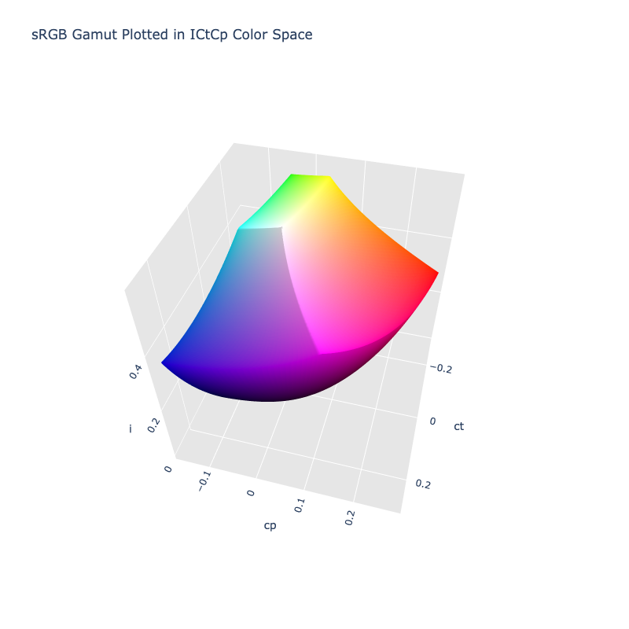

<figcaption markdown="1">Approximation[^1] of the sRGB gamut represented within the ICtCp color space.</figcaption>
</figure>

ICtCp is a color space format with better perceptual uniformity than [CIELAB](#cielab) and is used as a part of the
color image pipeline in video and digital photography systems for high dynamic range (HDR) and wide color gamut (WCG)
imagery. It was developed by Dolby Laboratories from the IPT color space by Ebner and Fairchild. It was designed with
the intention to replace YCbCr.

_[Learn about ICtCp](https://en.wikipedia.org/wiki/ICtCp)_
</div>

??? abstract "ColorAide Details"

    **Channel Aliases:**
    : 
        Channels | Aliases
        -------- | -------
        `i`      |
        `ct`     |
        `cp`     |

    **Inputs:**
    : 
        As ICtCp is not currently supported in the CSS spec, the parsed input and string output formats use the
        `#!css-color color()` function format using the custom name `#!css-color --ictcp`:

        ```css-color
        color(--ictcp i ct cp / a)  // Color function
        ```

        When manually creating a color via raw data or specifying a color space as a parameter in a function, the color
        space name is always used:

        ```py
        Color("ictcp", [0, 0, 0], 1)
        ```

    **Output:**
    : 
        The string representation of the color object and the default string output use the
        `#!css-color color(--ictcp i ct cp / a)` form.

        ```playground
        Color("ictcp", [0, 0, 0], 1)
        Color("ictcp", [0, 0, 0], 1).to_string()
        ```

## DIN99o

<div class="info-container" markdown="1">
!!! info inline end "Properties"

    **Name:** `din99o`

    **White Point:** D65

    **Coordinates:**

    Name | Range^\*^
    ---- | ---------
    l    | [0, 100]
    a    | [-55, 55]
    b    | [-55, 55]

    ^\*^ Space is not bound to the range and is only used as a reference to quantify percentage inputs/outputs in
    relation to the Display P3 color space.

<figure markdown="1">

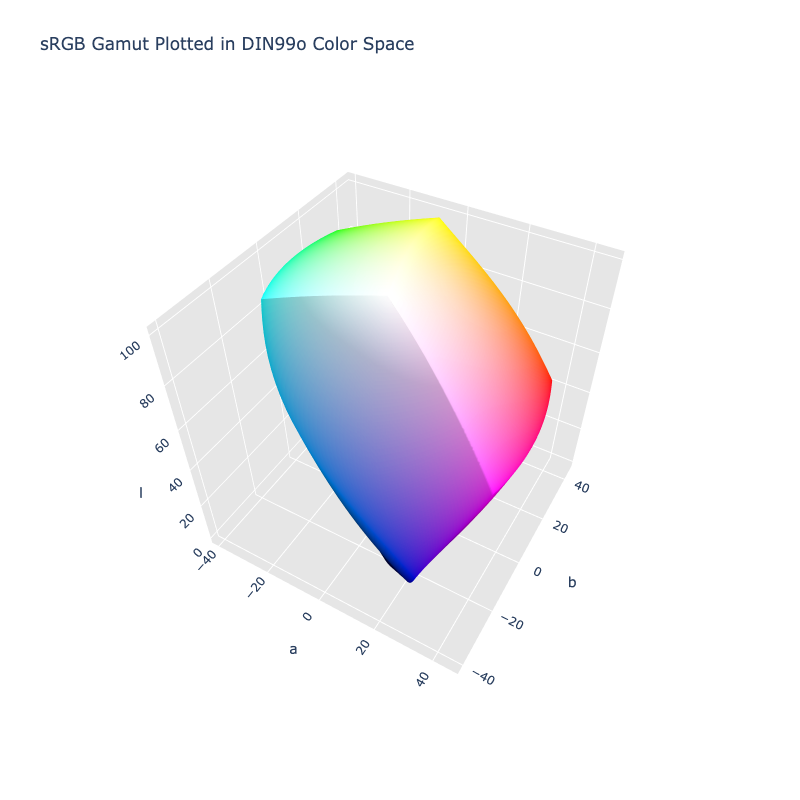

<figcaption markdown="1">Approximation[^1] of the sRGB gamut represented within the DIN99o color space.</figcaption>
</figure>

The DIN99 color space system is a further development of the CIELAB color space system developed by the FNF / FNL 2
Colorimetry Working Committee. It takes the CIELAB space (with a D65 illuminant) and compresses it such that the space
yields better equidistant using Euclidean distance. The whole color space is essentially modified to better fit the
color distancing algorithm opposed to CIELAB which has adapted the color distancing algorithm to better fit the color
space, the latest iteration being ∆E^\*^~00~.

_[Learn about DIN99o](https://de.wikipedia.org/wiki/DIN99-Farbraum)_
</div>

??? abstract "ColorAide Details"

    **Channel Aliases:**
    : 
        Channels | Aliases
        -------- | -------
        `l`      | `lightness`
        `a`      |
        `b`      |

    **Inputs:**
    : 
        As DIN99o is not currently supported in the CSS spec, the parsed input and string output formats use the
        `#!css-color color()` function format using the custom name `#!css-color --din99o`:

        ```css-color
        color(--din99o l u v / a)  // Color function
        ```

        When manually creating a color via raw data or specifying a color space as a parameter in a function, the color
        space name is always used:

        ```py
        Color("din99o", [0, 0, 0], 1)
        ```

    **Output:**
    : 
        The string representation of the color object and the default string output use the
        `#!css-color color(--din99o l u v / a)` form.

        ```playground
        Color("din99o", [0, 0, 0], 1)
        Color("din99o", [0, 0, 0], 1).to_string()
        ```

## DIN99o Lch

<div class="info-container" markdown="1">
!!! info inline end "Properties"

    **Name:** `lch99o`

    **White Point:** D65

    **Coordinates:**

    Name | Range^\*^
    ---- | ---------
    l    | [0, 100]
    c    | [0, 60]
    h    | [0, 360)

    ^\*^ Space is not bound to the range and is only used as a reference to quantify percentage inputs/outputs in
    relation to the Display P3 color space.

<figure markdown="1">


<figcaption markdown="1">Approximation[^1] of the sRGB gamut represented within the DIN99o Lch color space.</figcaption>
</figure>

DIN99o Lch is the cylindrical form of [DIN99o](#din99o).

_[Learn about DIN99o Lch](https://de.wikipedia.org/wiki/DIN99-Farbraum)_
</div>

??? abstract "ColorAide Details"

    **Channel Aliases:**
    : 
        Channels | Aliases
        -------- | -------
        `l`      | `lightness`
        `c`      | `chroma`
        `h`      | `hue`

    **Inputs:**
    : 
        As DIN99o Lch is not currently supported in the CSS spec, the parsed input and string output formats use the
        `#!css-color color()` function format using the custom name `#!css-color --lch99o`:

        ```css-color
        color(--lch99o jz cz hz / a)  // Color function
        ```

        When manually creating a color via raw data or specifying a color space as a parameter in a function, the color
        space name is always used:

        ```py
        Color("lch99o", [0, 0, 0], 1)
        ```

    **Output:**
    : 
        The string representation of the color object and the default string output use the
        `#!css-color color(--lch99o jz cz hz / a)` form.

        ```playground
        Color("lch99o", [0, 0, 0], 1)
        Color("lch99o", [0, 0, 0], 1).to_string()
        ```

[^1]: For the purposes of speed, 3D models are calculated by taking points on the outer shell of the sRGB gamut and
mapping those points to the color space of interest. While a more accurate model could be made by taking all points into
account, this approach gives a fairly good approximation of the shape of the sRGB gamut within the targeted color space.

<style>
.info-container {display: inline-block;}
</style>
