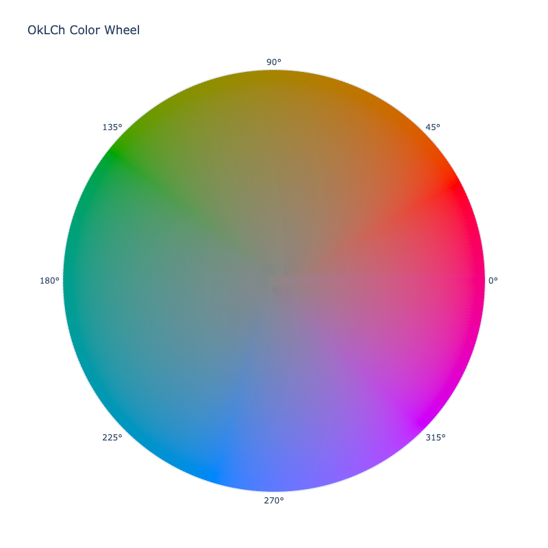
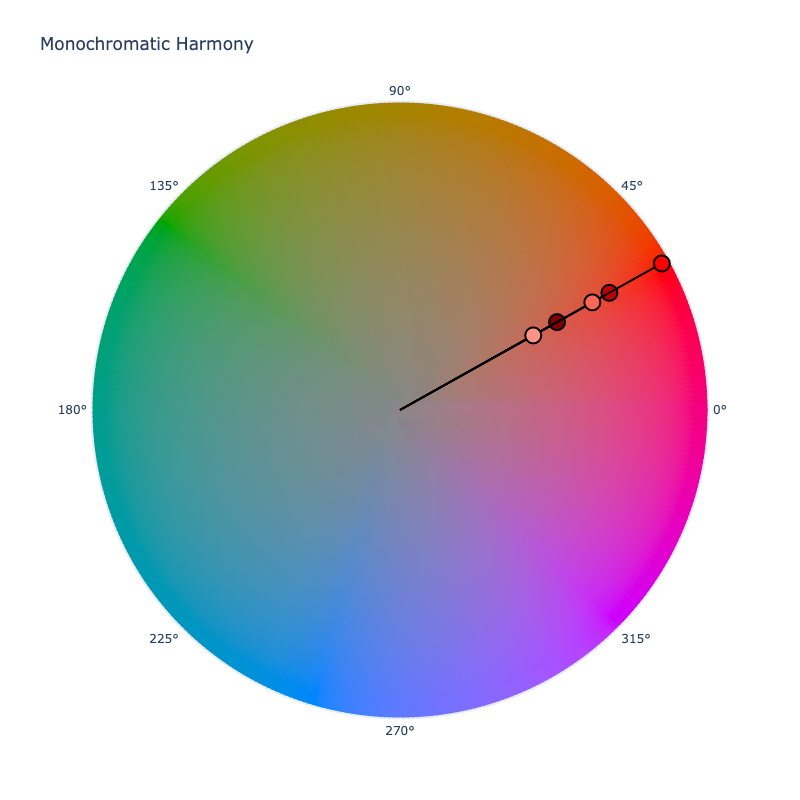
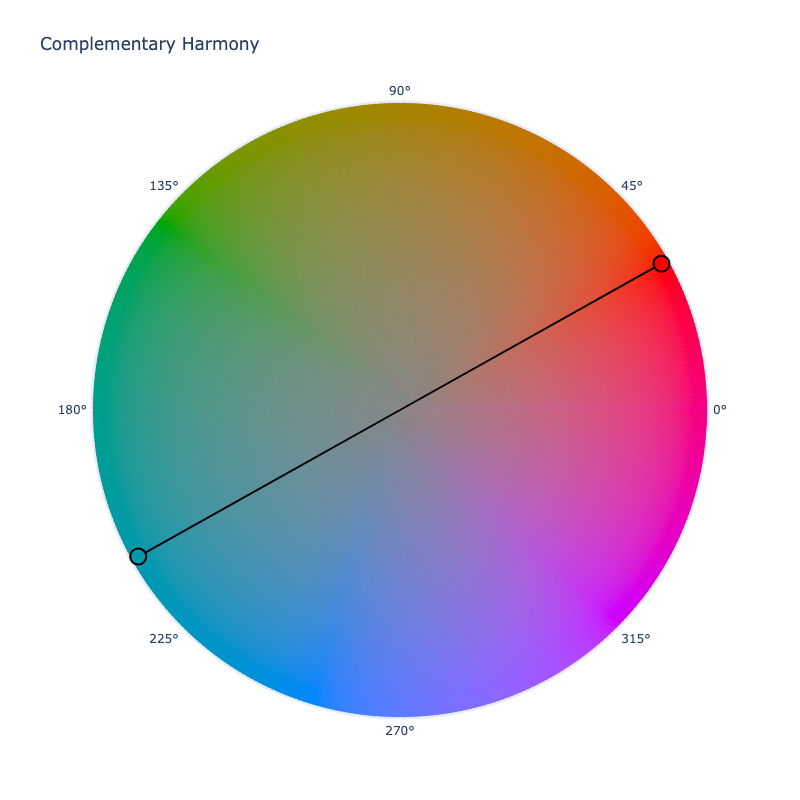
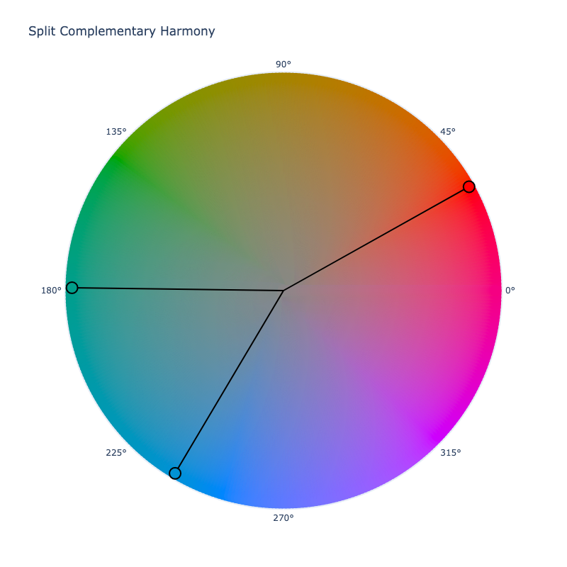
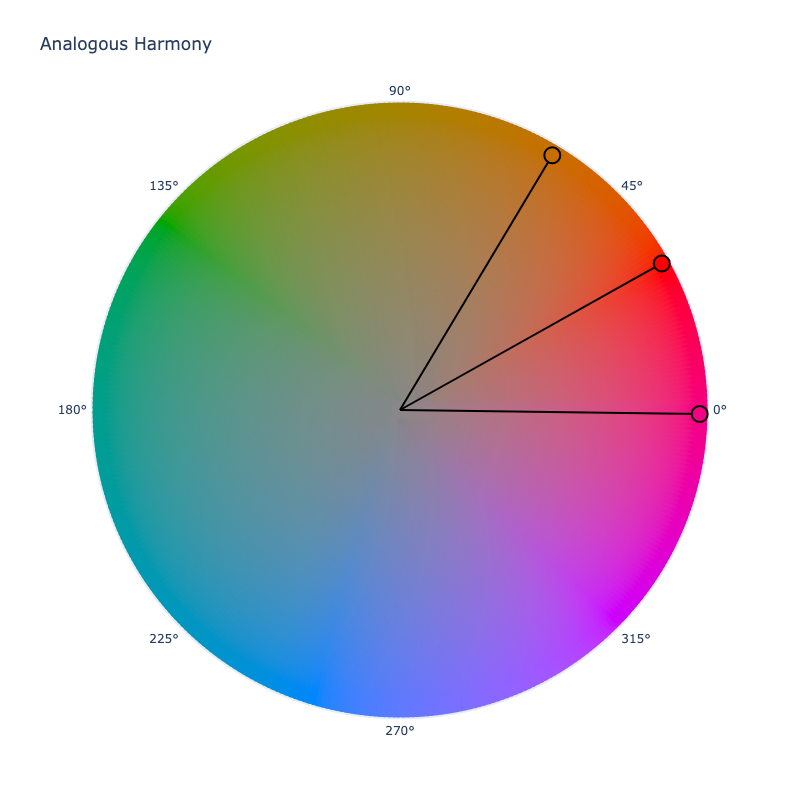
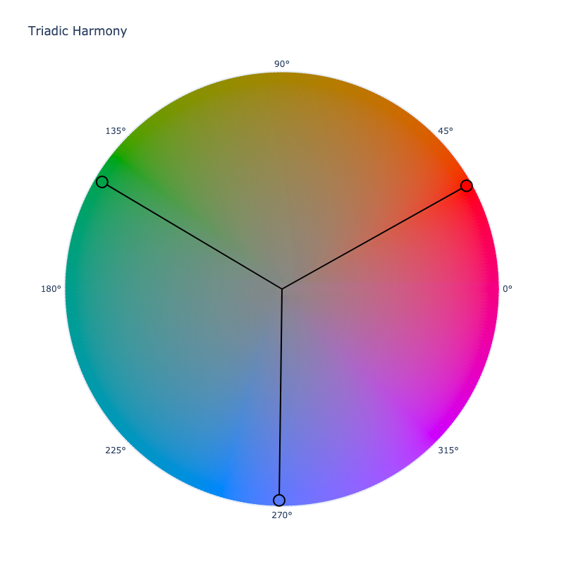
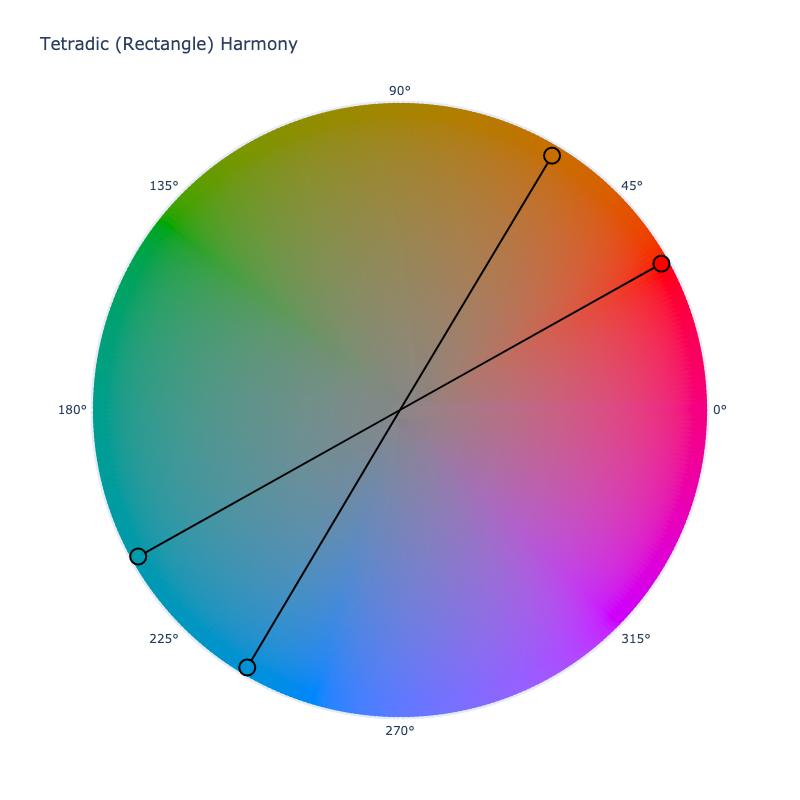

# Color Harmonies

In color theory, color harmony refers to the property that certain aesthetically pleasing color combinations have.
Modern day color theory actually originates from as far back as the Renaissance where the first concepts of the color
wheel were defined.

The original color wheel was created based on the mixing of pigments. As most know, in paint, red, yellow, and blue are
primary colors, and from them, all other hues are created. The traditional model, which we will call the RYB color
space, defined 12 colors that made up the wheel: the primary colors, the secondary colors, and the tertiary colors.
The secondary colors are created by evenly mixing the primary colors, and the tertiary colors are created by evenly
mixing those primary colors with the secondary colors.


From this wheel, it was noted that certain colors, based on their relative location on the wheel, were deemed pleasing
when viewed together. This is the idea behind harmonious colors and color schemes created from them.

## Which Color Space is Best for Color Harmonies?

The early work that created the color wheel was based on an RYB color space. In modern TVs and monitors, the RYB color
space is not used. Electronic screens create all their colors with light based methods that mix red, green, and blue
lights. In addition, the human eye perceives colors using red, green, and blue as well.

The colors of light generally behave and mix differently than pigments. Most modern color spaces are based on human
perception of light, so RGB based color spaces are quite a bit more common. If we were to compose a color wheel based on
the common sRGB color space, we could simply extract the colors at evenly spaced degrees, 30˚ to be exact.

```playground
HtmlSteps([Color('hsl', [x, 1, 0.5]) for x in range(0, 360, 30)])
```

From this we can construct our sRGB color wheel.


You could do this for almost any cylindrical color space and you'd get slightly different values. For instance, if we
were to select the perceptually uniform Oklch color space, and seed it with red's lightness and chroma, we'd get:

```playground
c = Color('red').convert('oklch', in_place=True)
HtmlSteps([Color('oklch', [*c[0:2], x]) for x in range(0, 360, 30)])
```

Well, which is better? That really depends on your criteria. The truth is, what is considered harmonious can be largely
subjective, and everyone has reasons for selecting certain color spaces as **the** color space to use.

Many artists swear by the classical color wheel, others are fine with using the sRGB color wheel as it is easy to work
with in CSS via the HSL color space, and there are still others that are more interested in perceptually uniform color
spaces that aim for more consistent hues and predictable lightness.

ColorAide, by default uses the perceptually uniform Oklch color space to calculate color harmonies. Oklch does a better
job at keeping hues constant, and the gamut of colors it can represent is not as limited as sRGB. With that said, there
may be reasons to select other color spaces. ColorAide allows for any cylindrical color space to be used instead of the
default. If you prefer sRGB, just specify HSL as the color space to use.

Use what you like, we won't judge :smile:.

```playground
HtmlSteps(Color('red').harmony('complement'))
HtmlSteps(Color('red').harmony('complement', space='hsl'))
```

## Supported Harmonies

ColorAide currently supports 7 color harmonies: [monochromatic](#monochromatic), [complementary](#complementary),
[split complementary](#split-complementary), [analogous](#analogous), [triadic](#triadic), [square](#tetradic-square),
and [rectangular](#tetradic-rectangular). By default, all color harmonies are calculated with the perceptually uniform
Oklch color space, but other color spaces can be used if desired.

While we use Oklch, we will actually visualize the examples in Okhsl. Oklch is a derivative of Oklch with the lightness
adjusted to match CIELCH and reshaped in a cylindrical form. It is limited to the sRGB gamut only, but it can help
visualize better what is happening in a familiar color wheel format. You can see the difference below:

=== "Oklch Color Slice"

    

=== "Okhsl Color Slice"

    


### Monochromatic

Monochromatic is probably the most straight forward color harmony. By specifying various tints and shades of a given
hue, very pleasing palettes can be created.

ColorAide will do its best to select colors with sufficient contrast between them. The specified color will usually be
in the middle, but in cases where the color is too close to black or white, it may be offset.

Additionally, the monochromatic harmony is the one color harmony that will accept non-cylindrical color spaces as the
target environment.



```playground
HtmlSteps(Color('red').harmony('mono'))
```
### Complementary

Complementary uses a dyad of colors at opposite ends of the color wheel.



```playground
HtmlSteps(Color('red').harmony('complement'))
```

### Split Complementary

Split Complementary is similar to complementary, but actually uses a triad of colors. Instead of just choosing one
complement, it splits and chooses two colors on the opposite side.



```playground
HtmlSteps(Color('red').harmony('split'))
```

### Analogous

Analogous harmonies consists of 3 adjacent colors.



```playground
HtmlSteps(Color('red').harmony('analogous'))
```

### Triadic

Triadic draws an equilateral triangle between 3 colors. For instance, the primary colors have triadic harmony.



```playground
HtmlSteps(Color('red').harmony('triad'))
```

### Tetradic Square

Tetradic color harmonies refer to a group of four colors. One tetradic color harmony can be found by drawing a square
between for colors.


```playground
HtmlSteps(Color('red').harmony('square'))
```

### Tetradic Rectangular

The rectangular tetradic harmony is very similar to square except that it draws a rectangle between for colors.



```playground
HtmlSteps(Color('red').harmony('rectangle'))
```
